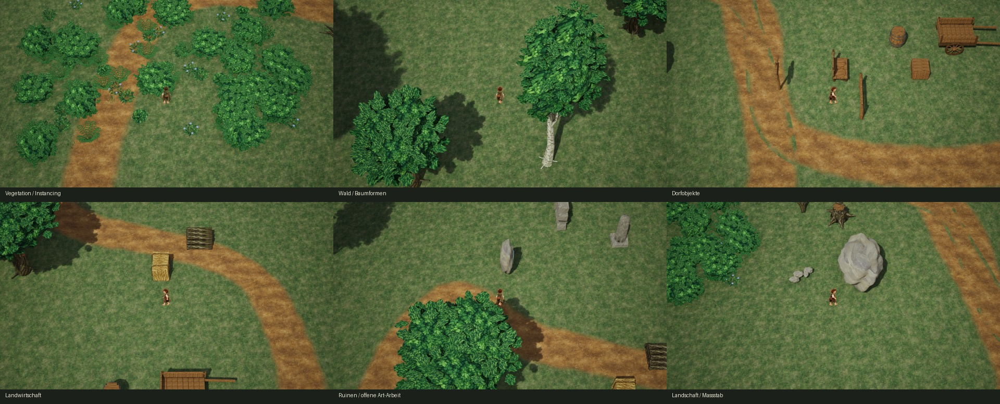

# Westland Asset Library V1 – Prüfbericht

Stand: 10.10.2026. Ausgangs- und Schluss-HEAD: `89b475e Add playable Westland region V1`.

## Ergebnis und Freigabegrenze

24 angefragte Grundtypen und 22 Varianten, insgesamt **46 Blender-/FBX-/Unreal-Meshes**. Dazu ein nicht kollidierender Review-Wege-Mesh, 17 Materialien/Instanzen und vier neue Unreal-Texturen: insgesamt **68 eigene UAssets** sowie die separate Map `/Game/Maps/Dev_WestlandAssetLibrary`.

**26 Meshes aus 14 Typen sind für die V1-Sichtprüfung nutzbar:** Bank, Zaun, Wegweiser, Karre, Fass, Kiste, Heuballen, Holzstapel, großer Felsen, kleine Steine, Gras, Kräuter, Wildblumen und Mauerrest. Das bedeutet eine technisch geprüfte V1, keine finale Art-Freigabe.

**20 Meshes aus 10 Typen benötigen noch Überarbeitung:** alte/junge Eiche, Birke, Obstbaum, Busch, Farn, Stumpf, Wurzel, Säule und Runenstein. Alle sind kontrolliert importierte Reviewobjekte. Die komplette Bibliothek erreicht noch nicht die finale malerische Referenzqualität. Keine Integration in die Region; keine massenhafte Verteilung der Reviewobjekte.

Verbindliche Blenderquelle: [WestlandAssetLibrary_V1.blend](../Art/World/WestlandAssetLibrary/Source/WestlandAssetLibrary_V1.blend). Gespeichert, Texturen gepackt, nach der letzten Änderung erfolgreich erneut geöffnet. 46 einzelne Meshes mit Asset-Markierung, Source- und Review-Szene. Die ursprünglich offene Blender-Szene mit Cube, Light und Camera wurde nicht verändert.

## Vorbereitung und Erhaltung

Anfangs offen war ausschließlich das bereitgestellte `Art/World/WestlandAssetLibrary/Preparation/Westland_AssetLibrary_Preparation.zip`. README, Auftrag, JSON-/CSV-Katalog wurden gelesen. Der Katalog enthält 74 Typen; die weiteren 50 Typen sind nicht Teil der behaupteten Fertigstellung. `CatalogReview_V1.json` dokumentiert Zuordnung, Wiederverwendung und zurückgestellte Einträge. Der optionale primitive Starter wurde nicht als fertige Art übernommen.

Die Westland Region V1 war in HEAD `89b475e` gesichert. Vor Beginn wurden 1174 versionierte Dateien gehasht. Bis zur Dokumentation waren **alle bytegleich**. Nach Abschluss sind ausschließlich `Docs/TECHNIK.md` und `Docs/ENTSCHEIDUNGEN.md` unter den Ausgangsdateien geändert. Region, bestehende Maps, C++, Gameplay und geteilte Assets bleiben bytegleich. Dev-Spielstand ebenfalls bytegleich: **True**. Keine Datei aus dem Ausgangsstand gelöscht oder zurückgesetzt. Kein Commit, kein Push, nichts gestaged.

## Gestaltung und Wiederverwendung

Gebogene Stämme/Äste, verformte Kronenvolumen und echte gebogene Blattflächen; gekrümmte Farne; modellierte Holzverbindungen, Bretter, Radnaben/Speichen, Fassringe und unregelmäßige Steinformen. Sechs Vertreter wurden zuerst gerendert und im Spiel geprüft. Gelbliche, lose erste Kronen wurden verworfen; grüne zusammenhängende Kronen und kontinuierliche Moostönung wurden erneut geprüft.

Die vorhandene `HH_Q3_Bench`-Konstruktion wird übernommen, keine zweite unnötige Bankform gebaut. Kräuter und Wildblumen übernehmen vorhandene Healing-House-Pflanzenkonstruktionen, mit entfernten Töpfen. Holz- und Steintexturen aus Quality V2 bleiben unverändert referenziert. Das ursprüngliche Building Kit und die Regionsmodelle werden nicht überschrieben. Alte Billboard-/Primitive-Bäume der Region ersetzen keine echten neuen Baumformen und wurden deshalb nicht als fertige 3D-Bibliothek dupliziert.

Neue Bildquellen wurden mit Imagegen erzeugt, ohne Marketplace-/Foto-/ROM-Downloads. Originalatlas 1254×1254, Rinde/Birke/Stroh jeweils 627×627, separate Sommerblattquelle 1254×1254; Unreal limitiert letztere auf 1024. Quellen und Provenienz unter `Textures/`. Keine erfundene 2K-/4K-Auflösung.

## Technik und Maßstab

Blender 5.2.2 LTS, Unreal 5.8.2, macOS. Meter in Blender, Zentimeter beim Import; angewandte Meshtransforms, Bodenursprünge und UV0. UV0 ist absichtliches Material-Tiling, kein exklusiver Atlas; Unreal erzeugt getrennt UV1. Keine fehlenden Material-/Texturreferenzen. Quellenprüfung: keine losen Vertices, keine flächenlosen Faces; bereinigte Blattenden und UV-Endflächen.

Zwei Default-Lit-Opaque-Master, jeweils ein Farbtextur-Sample und Tint/Vertexfarbe. Blattmaster zweiseitig, **keine Alpha-Masken/Transparenzüberzeichnung**. 1–5 Materialslots je Mesh. Insgesamt **264,762 LOD0-Dreiecke über alle 46 einzigartigen Meshes**; das ist kein gleichzeitig sichtbarer Dreieckzähler. Reduktion bei >1000 Dreiecken: 100/55/25 %, drei LODs; kleinere Meshes ein LOD. Distanzfelder dieser eigenen Meshes deaktiviert. Kein behaupteter finaler LOD-Freigabestand für die noch offenen Kronen.

**99 HISM-Unterwuchsinstanzen in neun Komponenten**, ohne Schatten/Kollision, Culling 65–90 m. Bäume haben Stamm-UCX, Möbel/Steine/Ruinen einfache UCX-Körper, kleines Boden-/Blattwerk keine Kollision. Diese großzügigen Review-Sichtweiten sind keine globale Regionsvorgabe; für dichte Regionen müssen kleinere Sichtweiten und Schattenbudgets separat abgestimmt werden.

Native Playerbasis unverändert: sichtbarer Körper 1,40 m, Bewegung 210 cm/s, CameraBoom 2500 cm, Pitch −55°, Yaw −45°, FOV 35°, Lag 12 / max 45 cm, Kamerakollision aus. PlayerStart in der neuen Map auf Yaw 0° korrigiert; dadurch bleibt die vorhandene relative Spriteausrichtung korrekt. Keine Blueprint-, Sprite-, Input- oder C++-Änderung.

## Assetliste

Maße sind lokale X×Y×Z in Metern, Kollisionszahl umfasst einfache/konvexe UCX-Körper. Details und Materialnamen: `Art/World/WestlandAssetLibrary/Assets.json`.

| Mesh | Maße m | LOD0-Tris | Slots | LODs | UCX | Artstand |
|---|---:|---:|---:|---:|---:|---|
| `SM_WLA_OakAncient_A` | 8.98 × 8.67 × 11.94 | 26720 | 4 | 3 | 1 | Feinschliff |
| `SM_WLA_OakYoung_A` | 4.18 × 3.91 × 5.20 | 16364 | 4 | 3 | 1 | Feinschliff |
| `SM_WLA_Fern_A` | 1.25 × 1.24 × 0.88 | 4212 | 3 | 3 | 0 | Feinschliff |
| `SM_WLA_Boulder_A` | 2.85 × 2.23 × 2.39 | 1280 | 1 | 3 | 1 | V1-Review |
| `SM_WLA_Bench_A` | 1.35 × 0.78 × 1.18 | 3772 | 2 | 3 | 2 | V1-Review |
| `SM_WLA_Runestone_A` | 1.20 × 0.68 × 2.41 | 1342 | 2 | 3 | 1 | Feinschliff |
| `SM_WLA_Birch_A` | 3.64 × 3.27 × 9.06 | 16364 | 4 | 3 | 1 | Feinschliff |
| `SM_WLA_FruitTree_A` | 5.66 × 4.91 × 5.40 | 19724 | 5 | 3 | 1 | Feinschliff |
| `SM_WLA_Bush_A` | 2.25 × 1.90 × 1.46 | 13426 | 4 | 3 | 0 | Feinschliff |
| `SM_WLA_Grass_A` | 0.43 × 0.54 × 0.38 | 576 | 2 | 1 | 0 | V1-Review |
| `SM_WLA_Herb_A` | 0.78 × 0.78 × 0.61 | 1152 | 3 | 3 | 0 | V1-Review |
| `SM_WLA_Wildflowers_A` | 0.78 × 0.79 × 0.58 | 2160 | 5 | 3 | 0 | V1-Review |
| `SM_WLA_SmallStones_A` | 0.89 × 1.18 × 0.41 | 6400 | 1 | 3 | 0 | V1-Review |
| `SM_WLA_Stump_A` | 1.80 × 1.64 × 0.93 | 1208 | 3 | 3 | 1 | Feinschliff |
| `SM_WLA_Root_A` | 1.75 × 1.70 × 0.49 | 251 | 1 | 1 | 0 | Feinschliff |
| `SM_WLA_Fence_A` | 1.98 × 0.17 × 1.16 | 656 | 2 | 1 | 1 | V1-Review |
| `SM_WLA_Signpost_A` | 1.10 × 0.13 × 2.15 | 280 | 2 | 1 | 1 | V1-Review |
| `SM_WLA_Cart_A` | 1.76 × 3.24 × 1.28 | 6196 | 3 | 3 | 3 | V1-Review |
| `SM_WLA_Barrel_A` | 0.86 × 0.86 × 1.00 | 2620 | 2 | 3 | 1 | V1-Review |
| `SM_WLA_Crate_A` | 0.90 × 0.89 × 0.70 | 4136 | 2 | 3 | 1 | V1-Review |
| `SM_WLA_Haybale_A` | 1.26 × 0.90 × 0.93 | 396 | 2 | 1 | 1 | V1-Review |
| `SM_WLA_Woodpile_A` | 1.35 × 1.32 × 0.74 | 1344 | 2 | 3 | 1 | V1-Review |
| `SM_WLA_Column_A` | 0.91 × 0.93 × 1.85 | 776 | 2 | 1 | 1 | Feinschliff |
| `SM_WLA_WallRemnant_A` | 2.74 × 0.64 × 1.52 | 3868 | 2 | 3 | 1 | V1-Review |
| `SM_WLA_OakAncient_B` | 9.03 × 8.64 × 11.71 | 26720 | 4 | 3 | 1 | Feinschliff |
| `SM_WLA_OakYoung_B` | 4.19 × 3.98 × 5.37 | 16364 | 4 | 3 | 1 | Feinschliff |
| `SM_WLA_Fern_B` | 1.21 × 1.17 × 0.76 | 4212 | 3 | 3 | 0 | Feinschliff |
| `SM_WLA_Boulder_B` | 2.83 × 2.47 × 2.43 | 1280 | 1 | 3 | 1 | V1-Review |
| `SM_WLA_Runestone_B` | 1.22 × 0.68 × 2.35 | 1342 | 2 | 3 | 1 | Feinschliff |
| `SM_WLA_Birch_B` | 3.95 × 3.36 × 9.09 | 16364 | 4 | 3 | 1 | Feinschliff |
| `SM_WLA_FruitTree_B` | 5.37 × 5.14 × 5.30 | 19724 | 5 | 3 | 1 | Feinschliff |
| `SM_WLA_Bush_B` | 2.20 × 2.05 × 1.42 | 13426 | 4 | 3 | 0 | Feinschliff |
| `SM_WLA_Grass_B` | 0.35 × 0.53 × 0.38 | 576 | 2 | 1 | 0 | V1-Review |
| `SM_WLA_Herb_B` | 0.91 × 0.91 × 0.71 | 1512 | 3 | 3 | 0 | V1-Review |
| `SM_WLA_SmallStones_B` | 1.05 × 1.15 × 0.38 | 6400 | 1 | 3 | 0 | V1-Review |
| `SM_WLA_Stump_B` | 1.70 × 1.69 × 1.02 | 1208 | 3 | 3 | 1 | Feinschliff |
| `SM_WLA_Root_B` | 1.74 × 1.48 × 0.55 | 251 | 1 | 1 | 0 | Feinschliff |
| `SM_WLA_Fence_B` | 1.98 × 0.17 × 1.16 | 656 | 2 | 1 | 1 | V1-Review |
| `SM_WLA_Signpost_B` | 1.10 × 0.13 × 2.15 | 280 | 2 | 1 | 1 | V1-Review |
| `SM_WLA_Cart_B` | 1.76 × 3.24 × 1.28 | 6196 | 3 | 3 | 3 | V1-Review |
| `SM_WLA_Barrel_B` | 0.92 × 0.93 × 1.00 | 2620 | 2 | 3 | 1 | V1-Review |
| `SM_WLA_Crate_B` | 0.90 × 0.90 × 0.70 | 4136 | 2 | 3 | 1 | V1-Review |
| `SM_WLA_Haybale_B` | 1.22 × 0.90 × 0.94 | 396 | 2 | 1 | 1 | V1-Review |
| `SM_WLA_Woodpile_B` | 1.62 × 1.32 × 0.51 | 1232 | 2 | 3 | 1 | V1-Review |
| `SM_WLA_Column_B` | 0.91 × 0.93 × 1.85 | 776 | 2 | 1 | 1 | Feinschliff |
| `SM_WLA_WallRemnant_B` | 2.78 × 0.64 × 1.51 | 3868 | 2 | 3 | 1 | V1-Review |

## Spielansichten und Fußprüfung

65×65-m-Reviewgelände mit Wald-/Unterwuchs-, Landschafts-, Dorf-, Landwirtschafts- und Ruinenclustern, separater Variantenbank und organischem Weg. Eigenständige Testmap, kein Umbau der Region. Keine NPCs oder neuen Spielsysteme.



Vollständiger finaler Enhanced-Input-Fußlauf **175.08 m**, **103.81 s Spielzeit**, ohne Teleports. Alle Bereiche erreicht, keine Map-Lücken; Menü öffnet Inventar, sperrt Eingabe und gibt sie nach Schließen zurück. Acht Bewegungsrichtungen bleiben erhalten. Rohbilder und Fußprotokoll: `Saved/WestlandAssetLibrary/PIE_Full_*.png`, `FullFootTest.json`. Bilder mit 1280×720 aus dem aktiven PIE-Viewport; das HUD wird im separaten `Shot showui`-Bild dokumentiert. Keine frei gesetzte Reviewkamera für diese Spielansichten.

Gefundene und behobene Fehler ausschließlich in eigenen Dateien: Zaunende und Holzstapel aus dem Prüfweg versetzt; verdrehter PlayerStart korrigiert; UV-Endflächen bereinigt; Blender-Materialsuffixe `.001` bei zwei übernommenen Pflanzen korrekt aufgelöst, damit Blätter keine Holzfarbe erhalten. Danach erneuter vollständiger Fußlauf, Bildprüfung und Audit. Keine Gameplaykorrektur nötig.

## Performance

Apple M4 / 16 GB. Editor-PIE **2640×1628**, Medium (`sg.*=1`), 75 % Renderauflösung, VSync aus, t.MaxFPS 0. Je Messung 5 s Aufwärmen + 30 s Leerlauf; keine Screenshot-, Fuß- oder Blenderjobs gleichzeitig. Sichtbarkeits-A/B ist ausschließlich temporär im PIE; danach werden alle Actors wieder eingeblendet. Vegetationsblick zu Fuß erreicht. Keine direkte Hochrechnung auf die Region.

| Blick | FPS, Slate | Median ms | p95 ms | GPU, CSV ms | GameThread, CSV ms | Samples |
|---|---:|---:|---:|---:|---:|---:|
| Startblick, Bibliothek sichtbar | 26.63 | 37.38 | 42.08 | 36.72 | 4.30 | 800 |
| Startblick, Bibliothek ausgeblendet | 27.57 | 36.08 | 41.03 | 35.40 | 4.45 | 828 |
| Vegetation, Bibliothek sichtbar | 25.00 | 38.80 | 51.38 | 39.18 | 4.50 | 751 |
| Vegetation, Bibliothek ausgeblendet | 26.47 | 36.34 | 49.17 | 36.85 | 4.41 | 796 |

Startblick zeigt nur einen Teil der Bibliothek. Der dichtere Pflanzenblick ist aussagekräftiger für die Unterwuchskosten. CSV-GPU-Passzeiten überlappen; nicht addieren. Vegetationsblick: Basepass 2.99 ms, ShadowProjection 3.13 ms. Ein großer Anteil erscheint als GPU/Unaccounted und wird nicht willkürlich einzelnen Assets zugeordnet.

Separater **Development-Standalone** (`UnrealEditor -game`), kein Paket: angefordert 1280×720, `-ForceRes -nohighdpi`, Medium/75 %, t.MaxFPS 60. Native CSV-Systemauflösung 1280×720. Editor blieb geöffnet. Leerlauf am PlayerStart, kein dichter Rundweg; Bootcapture 1800 Frames, erste 600 verworfen, **1200 Frames ausgewertet**: **34.67 FPS**, FrameTime 28.84 ms, p95 39.41 ms, GPU 25.85 ms, GameThread 2.08 ms. Andere Auflösung und Messmethode: kein unmittelbarer Vergleich zum Editor-PIE. Erfolgreiches Laden der Testmap und automatischer Exit nach Capture, kein Absturz.

RHI-DrawCalls/Primitives-Zähler sind in diesen Metal-Captures Null und **nicht zuverlässig verfügbar**. Sie werden nicht als echte Null-Renderingkosten ausgegeben. Keine erfundenen VRAM- oder Drawcallwerte. Roh-CSV/Log unter Saved; komprimierte Messwerte in `QA_V1.json`. Die frühere Region-Messung 26,33 FPS verwendet 2331×1346 und andere Inhalte. **Ein stabiles 60-FPS-Ziel ist nicht erreicht.**

## Prüfungen und offene Qualität

- **38/38 PokeMonster-Automationstests erfolgreich**, keine Testfehler oder Testwarnungen. Bestehender Bestand einschließlich Player, Creature, Battle, Capture, Encounter, Inventory, Save, Quest, Dialogue, Healing/Building/Region. Resultate unter `Saved/WestlandAssetLibrary/AutomationSummary.json`.
- Map Check **0 Fehler / 0 Warnungen** nach finalem Import und Platzierung.
- 46 Quellen erfolgreich wieder geöffnet; FBX-Export nur Mesh/UCX, vollständiger Bounds-/UV-/Material-/LOD-/Kollisionsaudit bestanden.
- Gezielte PIE-Capsulesweeps ignorieren alle anderen Actors und prüfen jeden vorgesehenen Blocker; kleiner Unterwuchs kollidiert nicht. Kamera-/Bewegungswerte geprüft.
- C++ unverändert, deshalb **kein C++-Build nötig**. Mesh-/Material-Import und DDC-Builds durchgeführt.
- Dev-Spielstand unverändert; keine Cloud-, Git- oder Runtime-Save-Aktion durch die Bibliotheksarbeit.

Offen vor finaler Art-/Regionsfreigabe:

1. **Kronen/Büsche:** sichtbare Blatt-/Kernübergänge, repetitive Blatttextur und noch zu ähnliche Blattformen, insbesondere Birke/Obstbaum. Silhouette und malerische Gruppen weiter verfeinern.
2. **Bäume/Büsche:** Unreal-Buildlogs melden weiterhin nahezu-null Normalen/Binormalen, trotz bereinigter Quelldegenerierungen/UVs und Neuberechnung. Aktuelle reine Farbmaterialien zeigen im Fußlauf keine schwarzen/falsch fehlenden Flächen; das ist dennoch eine technische Abweichung, vor finaler Freigabe und Normalmap-Einsatz zu beheben. Map Check prüft diese Importwarnungen nicht.
3. **Farn:** dichtere, botanisch glaubwürdigere Wedel und weichere Blattgruppierung.
4. **Stumpf/Wurzel:** weniger sternförmige/spitze Enden, organischere Wurzelübergänge.
5. **Säule/Runenstein:** stärkere glaubwürdige Verwitterung und tatsächlich eingearbeitete Runen statt aufgesetzter Linien. Diese beiden sind noch keine fertigen hochwertigen Ruinenassets.
6. **Reviewgelände:** einige Wegübergänge bleiben geometrisch, Beleuchtung ist ein ruhiger Prüfaufbau, keine finale Lichtinszenierung. Keine finale Referenzqualität behauptet.
7. Weitere Material-/LOD-/Schattenoptimierung und menschliche Sichtprüfung vor dichter Regionsverteilung.

## Dateien und Git

Geänderte ursprüngliche Dateien: `Docs/TECHNIK.md`, `Docs/ENTSCHEIDUNGEN.md`. Neu erstellt durch diese Aufgabe: **144 Dateien** einschließlich Bericht, Artquellen, Exporte, 68 UAssets, Map und Tools; das ursprüngliche Vorbereitungspaket ist separat erhalten, nicht von uns erstellt. Frühe Hero-Quellen bleiben erhaltene Arbeitsstände, werden nicht als aktuelle Libraryquelle empfohlen.

Vollständige Dateiliste unter den neuen Pfaden (einschließlich bereitgestelltem ZIP):

```text
Art/World/WestlandAssetLibrary/.DS_Store
Art/World/WestlandAssetLibrary/Assets.json
Art/World/WestlandAssetLibrary/CatalogReview_V1.json
Art/World/WestlandAssetLibrary/Exports/SM_WLA_Barrel_A.fbx
Art/World/WestlandAssetLibrary/Exports/SM_WLA_Barrel_B.fbx
Art/World/WestlandAssetLibrary/Exports/SM_WLA_Bench_A.fbx
Art/World/WestlandAssetLibrary/Exports/SM_WLA_Birch_A.fbx
Art/World/WestlandAssetLibrary/Exports/SM_WLA_Birch_B.fbx
Art/World/WestlandAssetLibrary/Exports/SM_WLA_Boulder_A.fbx
Art/World/WestlandAssetLibrary/Exports/SM_WLA_Boulder_B.fbx
Art/World/WestlandAssetLibrary/Exports/SM_WLA_Bush_A.fbx
Art/World/WestlandAssetLibrary/Exports/SM_WLA_Bush_B.fbx
Art/World/WestlandAssetLibrary/Exports/SM_WLA_Cart_A.fbx
Art/World/WestlandAssetLibrary/Exports/SM_WLA_Cart_B.fbx
Art/World/WestlandAssetLibrary/Exports/SM_WLA_Column_A.fbx
Art/World/WestlandAssetLibrary/Exports/SM_WLA_Column_B.fbx
Art/World/WestlandAssetLibrary/Exports/SM_WLA_Crate_A.fbx
Art/World/WestlandAssetLibrary/Exports/SM_WLA_Crate_B.fbx
Art/World/WestlandAssetLibrary/Exports/SM_WLA_Fence_A.fbx
Art/World/WestlandAssetLibrary/Exports/SM_WLA_Fence_B.fbx
Art/World/WestlandAssetLibrary/Exports/SM_WLA_Fern_A.fbx
Art/World/WestlandAssetLibrary/Exports/SM_WLA_Fern_B.fbx
Art/World/WestlandAssetLibrary/Exports/SM_WLA_FruitTree_A.fbx
Art/World/WestlandAssetLibrary/Exports/SM_WLA_FruitTree_B.fbx
Art/World/WestlandAssetLibrary/Exports/SM_WLA_Grass_A.fbx
Art/World/WestlandAssetLibrary/Exports/SM_WLA_Grass_B.fbx
Art/World/WestlandAssetLibrary/Exports/SM_WLA_Haybale_A.fbx
Art/World/WestlandAssetLibrary/Exports/SM_WLA_Haybale_B.fbx
Art/World/WestlandAssetLibrary/Exports/SM_WLA_Herb_A.fbx
Art/World/WestlandAssetLibrary/Exports/SM_WLA_Herb_B.fbx
Art/World/WestlandAssetLibrary/Exports/SM_WLA_OakAncient_A.fbx
Art/World/WestlandAssetLibrary/Exports/SM_WLA_OakAncient_B.fbx
Art/World/WestlandAssetLibrary/Exports/SM_WLA_OakYoung_A.fbx
Art/World/WestlandAssetLibrary/Exports/SM_WLA_OakYoung_B.fbx
Art/World/WestlandAssetLibrary/Exports/SM_WLA_Root_A.fbx
Art/World/WestlandAssetLibrary/Exports/SM_WLA_Root_B.fbx
Art/World/WestlandAssetLibrary/Exports/SM_WLA_Runestone_A.fbx
Art/World/WestlandAssetLibrary/Exports/SM_WLA_Runestone_B.fbx
Art/World/WestlandAssetLibrary/Exports/SM_WLA_Signpost_A.fbx
Art/World/WestlandAssetLibrary/Exports/SM_WLA_Signpost_B.fbx
Art/World/WestlandAssetLibrary/Exports/SM_WLA_SmallStones_A.fbx
Art/World/WestlandAssetLibrary/Exports/SM_WLA_SmallStones_B.fbx
Art/World/WestlandAssetLibrary/Exports/SM_WLA_Stump_A.fbx
Art/World/WestlandAssetLibrary/Exports/SM_WLA_Stump_B.fbx
Art/World/WestlandAssetLibrary/Exports/SM_WLA_WallRemnant_A.fbx
Art/World/WestlandAssetLibrary/Exports/SM_WLA_WallRemnant_B.fbx
Art/World/WestlandAssetLibrary/Exports/SM_WLA_Wildflowers_A.fbx
Art/World/WestlandAssetLibrary/Exports/SM_WLA_Woodpile_A.fbx
Art/World/WestlandAssetLibrary/Exports/SM_WLA_Woodpile_B.fbx
Art/World/WestlandAssetLibrary/Heroes.json
Art/World/WestlandAssetLibrary/Preparation/.DS_Store
Art/World/WestlandAssetLibrary/Preparation/Westland_AssetLibrary_Preparation.zip
Art/World/WestlandAssetLibrary/QA_V1.json
Art/World/WestlandAssetLibrary/README.md
Art/World/WestlandAssetLibrary/Review/Spielkamera_V1.jpg
Art/World/WestlandAssetLibrary/Source/WestlandAssetLibrary_HeroReview_V1.blend
Art/World/WestlandAssetLibrary/Source/WestlandAssetLibrary_HeroReview_V1b.blend
Art/World/WestlandAssetLibrary/Source/WestlandAssetLibrary_HeroReview_V1c.blend
Art/World/WestlandAssetLibrary/Source/WestlandAssetLibrary_V1.blend
Art/World/WestlandAssetLibrary/Textures/PROVENANCE.md
Art/World/WestlandAssetLibrary/Textures/T_WLA_Bark.png
Art/World/WestlandAssetLibrary/Textures/T_WLA_Birch.png
Art/World/WestlandAssetLibrary/Textures/T_WLA_Leaf.png
Art/World/WestlandAssetLibrary/Textures/T_WLA_LeafSummer.png
Art/World/WestlandAssetLibrary/Textures/T_WLA_PaintedAtlas_Source.png
Art/World/WestlandAssetLibrary/Textures/T_WLA_Straw.png
Content/Environment/WestlandAssetLibrary/Materials/MI_WLA_Apple.uasset
Content/Environment/WestlandAssetLibrary/Materials/MI_WLA_Bark.uasset
Content/Environment/WestlandAssetLibrary/Materials/MI_WLA_Birch.uasset
Content/Environment/WestlandAssetLibrary/Materials/MI_WLA_FlowerBlue.uasset
Content/Environment/WestlandAssetLibrary/Materials/MI_WLA_FlowerCream.uasset
Content/Environment/WestlandAssetLibrary/Materials/MI_WLA_Iron.uasset
Content/Environment/WestlandAssetLibrary/Materials/MI_WLA_Leaf.uasset
Content/Environment/WestlandAssetLibrary/Materials/MI_WLA_LeafDark.uasset
Content/Environment/WestlandAssetLibrary/Materials/MI_WLA_LeafLight.uasset
Content/Environment/WestlandAssetLibrary/Materials/MI_WLA_MossStone.uasset
Content/Environment/WestlandAssetLibrary/Materials/MI_WLA_Rune.uasset
Content/Environment/WestlandAssetLibrary/Materials/MI_WLA_Stone.uasset
Content/Environment/WestlandAssetLibrary/Materials/MI_WLA_Straw.uasset
Content/Environment/WestlandAssetLibrary/Materials/MI_WLA_Timber.uasset
Content/Environment/WestlandAssetLibrary/Materials/MI_WLA_Wood.uasset
Content/Environment/WestlandAssetLibrary/Materials/M_WLA_Painted.uasset
Content/Environment/WestlandAssetLibrary/Materials/M_WLA_PaintedLeaf.uasset
Content/Environment/WestlandAssetLibrary/Meshes/Farm/SM_WLA_Haybale_A.uasset
Content/Environment/WestlandAssetLibrary/Meshes/Farm/SM_WLA_Haybale_B.uasset
Content/Environment/WestlandAssetLibrary/Meshes/Farm/SM_WLA_Woodpile_A.uasset
Content/Environment/WestlandAssetLibrary/Meshes/Farm/SM_WLA_Woodpile_B.uasset
Content/Environment/WestlandAssetLibrary/Meshes/Landscape/SM_WLA_Boulder_A.uasset
Content/Environment/WestlandAssetLibrary/Meshes/Landscape/SM_WLA_Boulder_B.uasset
Content/Environment/WestlandAssetLibrary/Meshes/Landscape/SM_WLA_Root_A.uasset
Content/Environment/WestlandAssetLibrary/Meshes/Landscape/SM_WLA_Root_B.uasset
Content/Environment/WestlandAssetLibrary/Meshes/Landscape/SM_WLA_SmallStones_A.uasset
Content/Environment/WestlandAssetLibrary/Meshes/Landscape/SM_WLA_SmallStones_B.uasset
Content/Environment/WestlandAssetLibrary/Meshes/Landscape/SM_WLA_Stump_A.uasset
Content/Environment/WestlandAssetLibrary/Meshes/Landscape/SM_WLA_Stump_B.uasset
Content/Environment/WestlandAssetLibrary/Meshes/Review/SM_WLA_ReviewLoop.uasset
Content/Environment/WestlandAssetLibrary/Meshes/Ruins/SM_WLA_Column_A.uasset
Content/Environment/WestlandAssetLibrary/Meshes/Ruins/SM_WLA_Column_B.uasset
Content/Environment/WestlandAssetLibrary/Meshes/Ruins/SM_WLA_Runestone_A.uasset
Content/Environment/WestlandAssetLibrary/Meshes/Ruins/SM_WLA_Runestone_B.uasset
Content/Environment/WestlandAssetLibrary/Meshes/Ruins/SM_WLA_WallRemnant_A.uasset
Content/Environment/WestlandAssetLibrary/Meshes/Ruins/SM_WLA_WallRemnant_B.uasset
Content/Environment/WestlandAssetLibrary/Meshes/Trees/SM_WLA_Birch_A.uasset
Content/Environment/WestlandAssetLibrary/Meshes/Trees/SM_WLA_Birch_B.uasset
Content/Environment/WestlandAssetLibrary/Meshes/Trees/SM_WLA_FruitTree_A.uasset
Content/Environment/WestlandAssetLibrary/Meshes/Trees/SM_WLA_FruitTree_B.uasset
Content/Environment/WestlandAssetLibrary/Meshes/Trees/SM_WLA_OakAncient_A.uasset
Content/Environment/WestlandAssetLibrary/Meshes/Trees/SM_WLA_OakAncient_B.uasset
Content/Environment/WestlandAssetLibrary/Meshes/Trees/SM_WLA_OakYoung_A.uasset
Content/Environment/WestlandAssetLibrary/Meshes/Trees/SM_WLA_OakYoung_B.uasset
Content/Environment/WestlandAssetLibrary/Meshes/Vegetation/SM_WLA_Bush_A.uasset
Content/Environment/WestlandAssetLibrary/Meshes/Vegetation/SM_WLA_Bush_B.uasset
Content/Environment/WestlandAssetLibrary/Meshes/Vegetation/SM_WLA_Fern_A.uasset
Content/Environment/WestlandAssetLibrary/Meshes/Vegetation/SM_WLA_Fern_B.uasset
Content/Environment/WestlandAssetLibrary/Meshes/Vegetation/SM_WLA_Grass_A.uasset
Content/Environment/WestlandAssetLibrary/Meshes/Vegetation/SM_WLA_Grass_B.uasset
Content/Environment/WestlandAssetLibrary/Meshes/Vegetation/SM_WLA_Herb_A.uasset
Content/Environment/WestlandAssetLibrary/Meshes/Vegetation/SM_WLA_Herb_B.uasset
Content/Environment/WestlandAssetLibrary/Meshes/Vegetation/SM_WLA_Wildflowers_A.uasset
Content/Environment/WestlandAssetLibrary/Meshes/Village/SM_WLA_Barrel_A.uasset
Content/Environment/WestlandAssetLibrary/Meshes/Village/SM_WLA_Barrel_B.uasset
Content/Environment/WestlandAssetLibrary/Meshes/Village/SM_WLA_Bench_A.uasset
Content/Environment/WestlandAssetLibrary/Meshes/Village/SM_WLA_Cart_A.uasset
Content/Environment/WestlandAssetLibrary/Meshes/Village/SM_WLA_Cart_B.uasset
Content/Environment/WestlandAssetLibrary/Meshes/Village/SM_WLA_Crate_A.uasset
Content/Environment/WestlandAssetLibrary/Meshes/Village/SM_WLA_Crate_B.uasset
Content/Environment/WestlandAssetLibrary/Meshes/Village/SM_WLA_Fence_A.uasset
Content/Environment/WestlandAssetLibrary/Meshes/Village/SM_WLA_Fence_B.uasset
Content/Environment/WestlandAssetLibrary/Meshes/Village/SM_WLA_Signpost_A.uasset
Content/Environment/WestlandAssetLibrary/Meshes/Village/SM_WLA_Signpost_B.uasset
Content/Environment/WestlandAssetLibrary/Textures/T_WLA_Bark.uasset
Content/Environment/WestlandAssetLibrary/Textures/T_WLA_Birch.uasset
Content/Environment/WestlandAssetLibrary/Textures/T_WLA_LeafSummer.uasset
Content/Environment/WestlandAssetLibrary/Textures/T_WLA_Straw.uasset
Content/Maps/Dev_WestlandAssetLibrary.umap
Tools/DressWestlandAssetLibraryV1.py
Tools/ImportWestlandAssetLibraryV1.py
Tools/MeasureWestlandAssetLibraryV1PIE.py
Tools/SummarizeWestlandAssetLibraryV1Performance.py
Tools/TestWestlandAssetLibraryV1PIE.py
Tools/ValidateWestlandAssetLibraryV1.py
Tools/Blender/BuildWestlandAssetLibraryV1.py
Tools/Blender/ExportWestlandAssetLibraryV1.py
Tools/Blender/PackageWestlandAssetLibraryV1.py
Tools/Blender/ReviewWestlandAssetLibraryV1.py
Docs/WESTLAND_ASSET_LIBRARY_V1_PRUEFBERICHT.md
```

Rohbilder, Logs, Profile, temporäre FBX-/Blend-Sicherungen und Jobdateien unter `Saved/` gehören nicht ins Repository. Frühe `HeroReview_V1*.blend` und `Heroes.json` ebenfalls nicht automatisch zum vorgeschlagenen Sicherungspunkt hinzufügen.

Empfohlener gezielter Staging-Befehl **erst nach Sichtprüfung**, hier nicht ausgeführt:

```sh
git add -- Docs/TECHNIK.md Docs/ENTSCHEIDUNGEN.md Docs/WESTLAND_ASSET_LIBRARY_V1_PRUEFBERICHT.md \
  Art/World/WestlandAssetLibrary/README.md Art/World/WestlandAssetLibrary/Assets.json \
  Art/World/WestlandAssetLibrary/QA_V1.json Art/World/WestlandAssetLibrary/CatalogReview_V1.json \
  Art/World/WestlandAssetLibrary/Source/WestlandAssetLibrary_V1.blend \
  Art/World/WestlandAssetLibrary/Textures Art/World/WestlandAssetLibrary/Exports \
  Art/World/WestlandAssetLibrary/Review Art/World/WestlandAssetLibrary/Preparation/Westland_AssetLibrary_Preparation.zip \
  Content/Environment/WestlandAssetLibrary Content/Maps/Dev_WestlandAssetLibrary.umap \
  Tools/Blender/BuildWestlandAssetLibraryV1.py Tools/Blender/PackageWestlandAssetLibraryV1.py \
  Tools/Blender/ReviewWestlandAssetLibraryV1.py Tools/Blender/ExportWestlandAssetLibraryV1.py \
  Tools/ImportWestlandAssetLibraryV1.py Tools/DressWestlandAssetLibraryV1.py \
  Tools/ValidateWestlandAssetLibraryV1.py Tools/TestWestlandAssetLibraryV1PIE.py \
  Tools/MeasureWestlandAssetLibraryV1PIE.py Tools/SummarizeWestlandAssetLibraryV1Performance.py
```

`git diff --check`: abschließend ohne Ausgabe geprüft. Markdown/JSON/Python zusätzlich für neue, noch nicht versionierte Dateien geprüft. Kein Commit oder Push.

Abschließendes `git status --short`:

```text
 M Docs/ENTSCHEIDUNGEN.md
 M Docs/TECHNIK.md
?? Art/World/WestlandAssetLibrary/
?? Content/Environment/WestlandAssetLibrary/
?? Content/Maps/Dev_WestlandAssetLibrary.umap
?? Docs/WESTLAND_ASSET_LIBRARY_V1_PRUEFBERICHT.md
?? Tools/Blender/BuildWestlandAssetLibraryV1.py
?? Tools/Blender/ExportWestlandAssetLibraryV1.py
?? Tools/Blender/PackageWestlandAssetLibraryV1.py
?? Tools/Blender/ReviewWestlandAssetLibraryV1.py
?? Tools/DressWestlandAssetLibraryV1.py
?? Tools/ImportWestlandAssetLibraryV1.py
?? Tools/MeasureWestlandAssetLibraryV1PIE.py
?? Tools/SummarizeWestlandAssetLibraryV1Performance.py
?? Tools/TestWestlandAssetLibraryV1PIE.py
?? Tools/ValidateWestlandAssetLibraryV1.py
```
